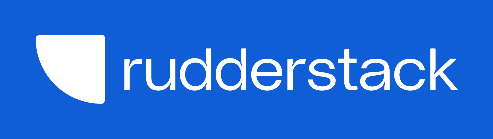
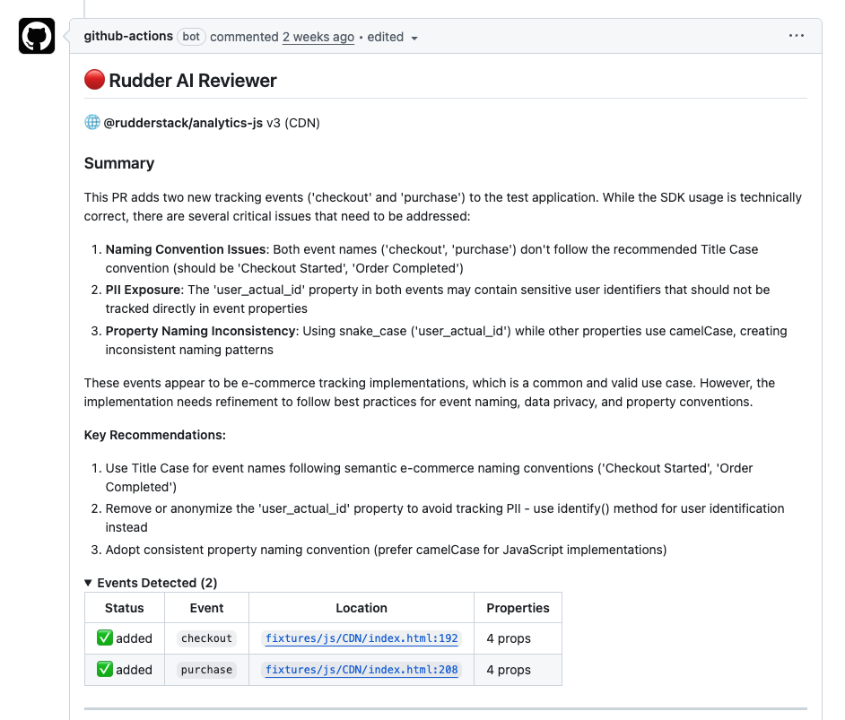
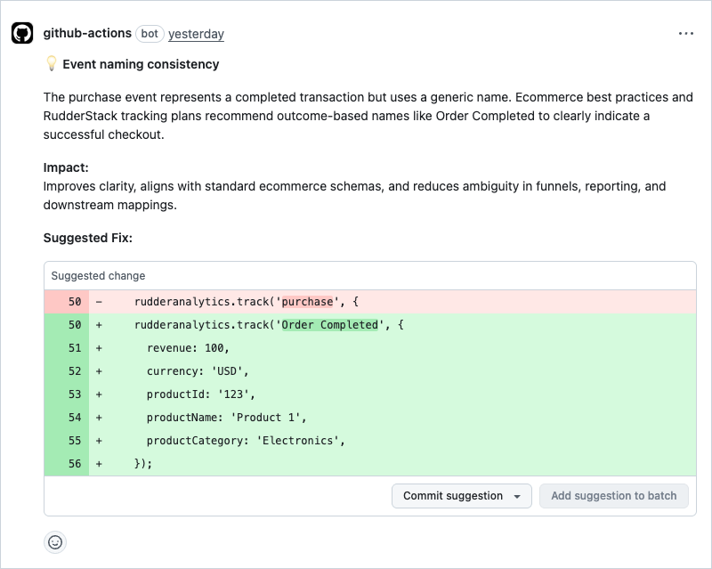

<p align="center">
  <a href="https://rudderstack.com/">
    
  </a>
  <br />
  <span>The Customer Data Platform for Developers</span>
</p>
<p align="center">
  <b>
    <a href="https://rudderstack.com">Website</a>
    ·
    <a href="https://rudderstack.com/docs/">Documentation</a>
    ·
    <a href="https://rudderstack.com/join-rudderstack-slack-community">Community Slack</a>
  </b>
</p>

---

# Rudder AI Reviewer

A GitHub Action to automatically review pull requests using AI for RudderStack SDK instrumentation changes.

## How It Works

The Rudder AI Reviewer analyzes your pull requests through an intelligent pipeline:

1. **SDK Detection** - Automatically detects RudderStack SDK installations (both npm packages and CDN script tags)
2. **Framework Identification** - Identifies your frontend framework (React, Next.js, Vue, Nuxt, or Angular)
3. **Diff Analysis** - Analyzes the PR diff to identify instrumentation changes
4. **AI Review** - Sends the context to RudderStack's AI review service for analysis
5. **Comment Generation** - Posts comprehensive summary comments and inline review comments directly on your PR

## Supported SDKs

**SDKs:**
- **@rudderstack/analytics-js** — via npm package or CDN `<script>` tag

## Prerequisites

Before using this action, you need:

1. **RudderStack Account** - Sign up at [rudderstack.com](https://rudderstack.com)
2. **Source ID** - Create a source in your RudderStack workspace and note its ID
3. **Service Access Token** - Generate a `Workspace SAT` with viewer permissions from your [organization settings](https://app.rudderstack.com/organization?tab=service_access_tokens)

## Usage

Add this workflow to your repository at `.github/workflows/rudder-ai-reviewer.yml`:

```yaml
name: Rudder AI Reviewer
on:
  pull_request:
    types: [opened, synchronize]

permissions:
  contents: read        # Required to checkout the repository
  pull-requests: write  # Required to post review comments

jobs:
  review:
    runs-on: ubuntu-latest
    steps:
      - uses: actions/checkout@93cb6efe18208431cddfb8368fd83d5badbf9bfd # v5.0.1

      - name: Rudder AI Reviewer
        uses: rudderlabs/rudder-ai-reviewer@v1
        with:
          source-id: ${{ secrets.RUDDERSTACK_SOURCE_ID }}
          service-access-token: ${{ secrets.RUDDERSTACK_SERVICE_ACCESS_TOKEN }}
```

## Inputs

| Input | Description | Required | Default |
|-------|-------------|----------|---------|
| `source-id` | ID of the RudderStack source | Yes | - |
| `service-access-token` | Workspace SAT with editor permissions | Yes | - |
| `root-directory` | Root directory of the project (useful for monorepos) | No | `.` |
| `github-token` | GitHub token for API access | No | ${{ github.token }} |

## Outputs

| Output | Description |
|--------|-------------|
| `status` | Status of the review: `success`, `failed`, or `warning` |
| `message` | Summary message from the review |

## What It Reviews

The AI reviewer analyzes your RudderStack SDK instrumentation changes and provides feedback across multiple categories:

**Review Categories:**
- **Tracking Plan Violations** - Detects deviations from your defined tracking plan
- **Missing Events** - Identifies important user actions that aren't being tracked
- **Best Practices** - Suggests improvements to follow RudderStack SDK best practices
- **Security** - Flags potential security issues in your instrumentation
- **Performance** - Identifies performance concerns in your tracking implementation
- **Deprecated API Usage** - Warns about deprecated SDK methods and suggests alternatives
- **Incorrect Property Usage** - Flags incorrect property usage in your instrumentation

## Examples

The action posts two types of review comments on your pull requests:

### Summary Comment

A comprehensive summary comment is posted at the PR level, providing an overview of all findings:



### Inline Comments

Specific issues are highlighted directly on the relevant lines of code with actionable suggestions:



## Monorepo Support

If your repository is a monorepo and the instrumented application is in a subdirectory, use the `root-directory` input to specify the path:

```yaml
- name: Rudder AI Reviewer
  uses: rudderlabs/rudder-ai-reviewer@v1
  with:
    source-id: ${{ secrets.RUDDERSTACK_SOURCE_ID }}
    service-access-token: ${{ secrets.RUDDERSTACK_SERVICE_ACCESS_TOKEN }}
    root-directory: 'apps/frontend'  # Path to your app
```

## License

Elastic-2.0
